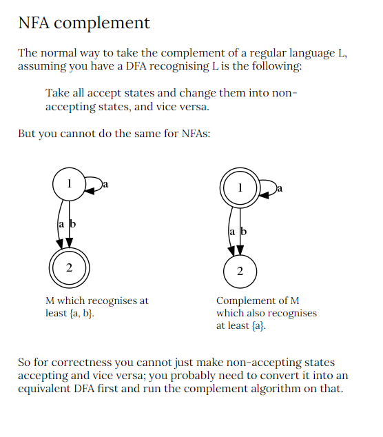
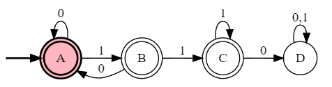
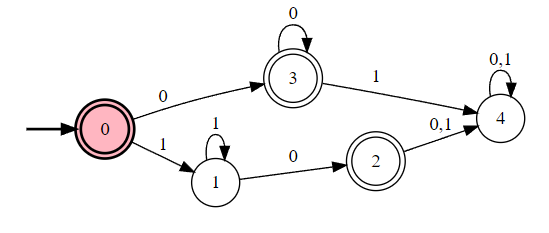

# 1
## a 
T
Let L is a finite language, and Let |L| = n, for some $n \geq 0$
For n = 0, $L = \phi$ and it is regular.
For $n>0$, 
lets , $L = \{a_1, a_2, a_3,....a_n\}$ where $a_k\ for \ k \geq 1$ is the individual string in $L$.
Now, for each string $a_k \in L$ we generate a new Language, $L_k = {a_k}$ for $k\geq 1$.
We can draw a DFA for a language that define a single string. therefore all $L_k$ for $k\geq 1$ is regular.
Since, $L = L_1 \cup L_2 \cup .....\cup L_k$ and set of regular language is closed under Union operation. therefore L is a regular language.

## b
F, proof this by showing an example.
:question: For proving false when we have Every in the statement, giving one example contradicting the statement should suffice to proof that the satement is false.
We will disprove this satement with an example,
Let, $L = \{W \in \{0, 1\}^*$| W contains an even number of 0's$\}$
This is a regular language as we have constructed this DFA in Lecture 7, but it is a infinite language.
## c
T
If L is regular then there is a Machine M that outputs yes for all string $x \in L$.
Now since L

For input alphabets a and b, a* b* is regular. A DFA can be drawn for a* b* but $a^nb^n $for n≥0 which is a subset of a*b* is not regular as we cannot define a DFA for it.

Language of all binary string is regular, we can draw a DFA. with one state.
But $L_m = \{W \in \{0,1\}*$|$W = 0^k1^k,$for $k\geq 0\}$ is not regular even thous it is a subset of all binary string.
## d
F
Q1:Prove that Regular Sets are NOT closed under infinite union. (A counterexample suffices).

Ans1: Consider the sets {0}, {01}, {0011}, etc. Each one is regular because it only contains one string. But the infinite union is the set {0i1i | i>=0} which we know is not regular. So the infinite union cannot be closed for regular languages.

Q2: What about infinite intersection?

Ans2: We know that

{0i1i | i>=0} = {0} U {01} U {0011} U ...,

Taking complements and applying DeMorgan's law gives us

{0i1i | i>=0}c = {0}c ^ {01}c ^ {0011}c ^ ...,

## e
Regular language are closed under union.
## f

```
#states
A
B
C
#initial
A
#accepting
A
B
#alphabet
0
1
#transitions
A:0>A,B
A:1>A
B:1>C
```
Try 2 strings ending with 01 and see the difference in this DFA
Give counter example.
## g
F, proof this by showing an example
$L$ = {00, 1, 10, 11}
A = 00
B = 1
X = 0
Accordign to definition, $\forall,$X if $AX \in L$ if and only if $BX \in L$,
but in our example, $AX \notin L$ but $BX \in L$
# 2
## a 
$\mathscr{L}(M) = \{W \in {0, 1}^* | W\ has\ no\ consecutive\ 0's\}$
$ = Empty String

0+(1+$+01)(1+01)*(0+1+$+01)+1+$+01

0+(1+01)(1+01)*(0+1+01)+1+$+01

Final : $(1^*(01)^*)^*$

- State A:
  - No consecutive 0 is found 
  - string ends in 1
- State B:
  - No consecutive 0 is found
  - string ends with 0
- State C:
  - Have seen 2 or more consecutive 0's

#### Invariants
| No  | State | Invariant                                               |
| --- | :---: | ------------------------------------------------------- |
| 1   |   A   | String has no consecutive 2 0's.                        |
| 2   |   B   | String has no consecutive 2 0's. Last symbol read is 0. |
| 3   |   C   | Have seen at least one instance of consecutive 0's.     |

Proof:
We proceed by induction on the length of an arbritary string $W$.

#### Base case
For the base case, $W=\epsilon$, notice that we are in $A$and $W$ has no 2 consecutive 0's. hence out invariant 1 is true.

When $W=\epsilon$ we are not in state B and C, so invariant 2 and 3 are are vacuously true.

#### Induction hypothesis
1. If the current state A, then W has no consecutive 2 0's. Last symbol read is 1.
2. If the current state B, then W has no consecutive 2 0's. Last symbol read is 0.
3. If the current state C, then W has at least one consecutive 2 0's.

#### Inductive step
Let's consider a string W of length $k+1$
##### Invariant 1
Direct Proof: Suppose that after reading $W = Y \cdot z$, the current state is $A$,

for z = 1
For M we conclude that the machine was in state $A$ or $B$ after reading $Y$. 
By induction hypothesis $Y$ has no 2 consecutive 2 0's.
Therefore for $z = 1$, $W = Y \cdot z$ has no 2 consecutive 0's and last symbol of $W$ is 1.

##### Invariant 2
Direct Proof: Suppose that after reading $W = Y \cdot z$, the current state is $B$,

for z = 0,
for M we conclude that the machine was in state $A$ after reading $Y$. 
By induction hypothesis $Y$ has no 2 consecutive 0's and last symbol read is 1.
Therefore for $z = 0$, $W = Y \cdot z$ has no 2 consecutive 0's and last symbol of $W$ is 0.

##### Invariant 3
Direct Proof: Suppose that after reading $W = Y \cdot z$, the current state is $C$,

###### Case 1
z = 0
For given M, we conclude that the machine was in state $B$ or $C$ after reading $Y$

- Case 1.1 (machine was in state $B$)
  - By induction hypothesis, $Y$ has no 2 consecutive 0 and the last symbol of the string is 0.
  - Since z = 0, $W = Y \cdot z$ has at least one consecutive 2 0's.
- Case 1.2 (machine was in state $C$)
  - By induction hypothesis, $Y$ has at least one consecutive 2 0's.
  - therefore W also has at least one consecutive 2 0's.

###### Case 2
z = 1
For given M, we conclude that the machine was in state $C$ after reading $Y$
By induction hypothesis $Y$ has at least one consecutive 2 0's.
therfore $W$ has at least one consecutive 2 0's.

Hence by induction principle all the invariants are proved.

- From the machine description we see that the accepting states are $A,\ B$
- We proved invariant 1: if the machine is in state A, then the string has no consecutive 2 0's.
- We proved invariant 2: if the machine is in state B, then the string has no consecutive 2 0's.
- We proved invariant 3: if the machine is in state C, then the string has at least 1 consecutive 2 0's.
- In other words M accepts $W \implies W \in L$, and, M rejects $W \implies W \notin L$, as rquired.


<!-- ```
#states
A
B
C
#initial
A
#accepting
A
B
#alphabet
0
1
#transitions
A:0>B
A:1>A
B:0>C
B:1>A
C:0>C
C:1>C
``` -->
http://ivanzuzak.info/noam/webapps/fsm2regex/

### b
<center><span style="color:blue">Lec 8 Regular Languages and Invariants</span></center>

## 3
### a
0(0+1)*1+1(0+1)*0

<!-- ```
#states
A
B
C
D
E
#initial
A
#accepting
C
E
#alphabet
0
1
#transitions
A:0>B
A:1>D
B:0>BB:1>C
C:0>B
C:1>C
D:0>E
D:1>D
E:0>E
E:1>D
``` -->

0(0+1)*1+1(0+1)*0

### b

((00)*0)(11)*+(00)*((11)*1)

(00)*(0(11)*+(11)*1)

<!-- ```
#states
A
B
C
D
E
F
#initial
A
#accepting
E
F
#alphabet
0
1
#transitions
A:0>B
B:0>C
B:1>D
C:0>B
C:1>F
D:1>E
E:1>D
F:1>C   
```  -->

### c

(0+10)*11(1)*0(1+0)*


<!-- ```
#states
A
B
C
D
#initial
A
#accepting
A
B
C
#alphabet
0
1
#transitions
A:0>A
A:1>B
B:0>A
B:1>C
C:0>D
C:1>C
D:0>D
D:1>D
``` -->

## 4
:question: When considering Equivalence classes, does the total number of equivalence classes include the rjection state? How to interpret the rejection state.
:question: Can we ndescibe equivalence class using regular expression, such as, $C_n = \{W \in \{0, 1\}^* | W = 11^*0(0+1)+00^*1\}$
:question: Can we prove either or for equivalence. Say for example no matter waht X is AX and BX is never in L as A and B
:question: What if a equivalence class has only one element? How to prove that it's a equivalence class.
### a


__Equivalence class__:
1. $1 \cdot 1^*$
2. $\epsilon$
3. $0 \cdot 0^*$
4. $1 \cdot 1^*0$

| Class | Regular Expression                             |Set builder notation
| ----- | ---------------------------------------------- |-
| $C_1$ | $1 \cdot 1^*$                                  |$\{W \in \{0, 1\}^* \| W=1^k\ where\ k \geq 1\}$
| $C_2$ | $\epsilon$                                     |$\{W \in \{0, 1\}^* \| W=\epsilon\}$
| $C_3$ | $0 \cdot 0^*$                                  |$\{W \in \{0, 1\}^* \| W=0^k\ where\ k \geq 1\}$
| $C_4$ | $1 \cdot 1^*0$                                 |$\{W \in \{0, 1\}^* \| W=1^k0\ where\ k \geq 1\}$
| $C_5$ | $1 \cdot 1^* \cdot 0(0+1)+0 \cdot 0^* \cdot 1$ |$\{W \in \{0, 1\}^* \| W=1^k0\ where\ k \geq 1\}$

### b
##### C1
Let A and B be 2 arbritary string in $C_1$,
Consider an arbritary string X,
case 1 X = $1^k0$ where $k \geq 0$
then, $AX$ and $BX$ in L
case 2 $X \not ={1^k0} $ where $k \geq 0$
then, $AX$, $BX$ not in L
##### C2
Let A and B be 2 arbritary string in $C_2$,
Consider an arbritary string X,
Since $C_2$ has only one element therefore it is vacuaously true

##### C3
Let A and B be 2 arbritary string in $C_3$,
Consider an arbritary string X,
case 1 $X \in \{W \in \{0, 1\}^*|W = 0^n\ for\ n \geq 0\}$
the both $AX$ and $BX$ are of the form $0^m$ where $m \geq 0$ and thus $AX, BX \in L$
:question: Is this a complement? Is this complement valid?
case 2 $X \notin \{W \in \{0, 1\}^*|W = 0^n\ for\ n \geq 0\}$
> case 2 $X \notin \{W \in \{0, 1\}^*|W\ has\ 1\ as substring\}$
> 


the both $AX$ and $BX$ are not in L, as for a string starting with 0 can only contain 0, but X has at least 1 and thus both $AX$ and $BX$ at least one or more 1.
##### C4
Let A and B be 2 arbritary string in $C_4$,
Consider an arbritary string X,
case 1 X = $\epsilon$
the both $AX$ and $BX$ $\in L$

case 2 $X \not ={\epsilon}$
the both $AX$ and $BX$ $\notin L$

##### C5
Let A and B be 2 arbritary string in $C_5$,
Consider an arbritary string X,
for all X $AX$ and $BX$ $\notin L$

##### To prove $C_1, C_2$
We chose 11 from $C_1$ and $\epsilon$ from $C_2$,
for X = $\epsilon$
$11 \cdot X \notin L$
$\epsilon \cdot X \in L$
therfore, $C_1, C_2$ forms seperate equivalence class

##### To prove $C_1, C_3$
We chose 11 from $C_1$ and 00 from $C_3$,
for X = 00
$11 \cdot X \notin L$
$00 \cdot X \in L$

therfore, $C_1, C_3$ forms seperate equivalence class

##### To prove $C_1, C_4$
We chose 11 from $C_1$ and $110$ from $C_4$,
for X = 0
$11 \cdot X \in L$
$110 \cdot X \notin L$
therfore, $C_1, C_2$ forms seperate equivalence class

##### To prove $C_1, C_5$
We chose 11 from $C_1$ and $101$ from $C_5$,
for X = $0$
$11 \cdot X \in L$
$101 \cdot X \notin L$

therfore, $C_1, C_5$ forms seperate equivalence class

##### To prove $C_2, C_3$
We chose $\epsilon$ from $C_2$ and $0$ from $C_3$,
for X = $10$
$\epsilon \cdot X \in L$
$0 \cdot X \in L$
therfore, $C_2, C_3$ forms seperate equivalence class

##### To prove $C_2, C_4$
We chose $\epsilon$ from $C_2$ and $10$ from $C_4$,
for X = $0$
$\epsilon \cdot X \in L$
$10 \cdot X \notin L$
therfore, $C_2, C_4$ forms seperate equivalence class

##### To prove $C_2, C_5$
We chose $\epsilon$ from $C_2$ and $101$ from $C_4$,
for X = $0$
$\epsilon \cdot X \in L$
$101 \cdot X \notin L$
therfore, $C_2, C_5$ forms seperate equivalence class

##### To prove $C_3, C_4$
We chose 00 from $C_3$ and $10$ from $C_4$,
for X = $0$
$00 \cdot X \in L$
$10 \cdot X \notin L$
therfore, $C_3, C_4$ forms seperate equivalence class

##### To prove $C_3, C_5$
We chose 11 from $C_3$ and $101$ from $C_5$,
for X = $0$
$00 \cdot X \in L$
$101 \cdot X \notin L$
therfore, $C_3, C_5$ forms seperate equivalence class

##### To prove $C_4, C_5$
We chose 10 from $C_4$ and $101$ from $C_5$,
for X = $\epsilon$
$10 \cdot X \in L$
$101 \cdot X \notin L$
therfore, $C_4, C_5$ forms seperate equivalence class

