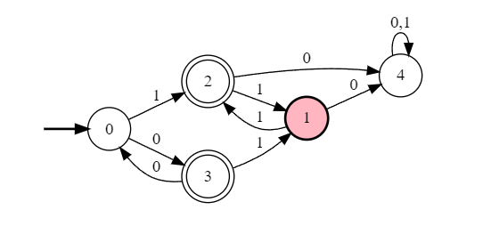

# 2
## a 
$\mathscr{L}(M) = \{W \in {0, 1}^* | W\ has\ no\ consecutive\ 0's\}$
$ = Empty String

0+(1+$+01)(1+01)*(0+1+$+01)+1+$+01

0+(1+01)(1+01)*(0+1+01)+1+$+01

Final : $(1^*(01)^*)^*$

- State A:
  - No consecutive 0 is found 
  - string ends in 1
- State B:
  - No consecutive 0 is found
  - string ends with 0
- State C:
  - Have seen 2 or more consecutive 0's

#### Invariants
| No  | State | Invariant                                               |
| --- | :---: | ------------------------------------------------------- |
| 1   |   A   | String has no consecutive 2 0's.                        |
| 2   |   B   | String has no consecutive 2 0's. Last symbol read is 0. |
| 3   |   C   | Have seen at least one instance of consecutive 0's.     |

Proof:
We proceed by induction on the length of an arbritary string $W$.

#### Base case
For the base case, $W=\epsilon$, notice that we are in $A$and $W$ has no 2 consecutive 0's. hence out invariant 1 is true.

When $W=\epsilon$ we are not in state B and C, so invariant 2 and 3 are are vacuously true.

#### Induction hypothesis
1. If the current state A, then W has no consecutive 2 0's. Last symbol read is 1.
2. If the current state B, then W has no consecutive 2 0's. Last symbol read is 0.
3. If the current state C, then W has at least one consecutive 2 0's.

#### Inductive step
Let's consider a string W of length $k+1$
##### Invariant 1
Direct Proof: Suppose that after reading $W = Y \cdot z$, the current state is $A$,

for z = 1
For M we conclude that the machine was in state $A$ or $B$ after reading $Y$. 
By induction hypothesis $Y$ has no 2 consecutive 2 0's.
Therefore for $z = 1$, $W = Y \cdot z$ has no 2 consecutive 0's and last symbol of $W$ is 1.

##### Invariant 2
Direct Proof: Suppose that after reading $W = Y \cdot z$, the current state is $B$,

for z = 0,
for M we conclude that the machine was in state $A$ after reading $Y$. 
By induction hypothesis $Y$ has no 2 consecutive 0's and last symbol read is 1.
Therefore for $z = 0$, $W = Y \cdot z$ has no 2 consecutive 0's and last symbol of $W$ is 0.

##### Invariant 3
Direct Proof: Suppose that after reading $W = Y \cdot z$, the current state is $C$,

###### Case 1
z = 0
For given M, we conclude that the machine was in state $B$ or $C$ after reading $Y$

- Case 1.1 (machine was in state $B$)
  - By induction hypothesis, $Y$ has no 2 consecutive 0 and the last symbol of the string is 0.
  - Since z = 0, $W = Y \cdot z$ has at least one consecutive 2 0's.
- Case 1.2 (machine was in state $C$)
  - By induction hypothesis, $Y$ has at least one consecutive 2 0's.
  - therefore W also has at least one consecutive 2 0's.

###### Case 2
z = 1
For given M, we conclude that the machine was in state $C$ after reading $Y$
By induction hypothesis $Y$ has at least one consecutive 2 0's.
therfore $W$ has at least one consecutive 2 0's.

Hence by induction principle all the invariants are proved.

- From the machine description we see that the accepting states are $A,\ B$
- We proved invariant 1: if the machine is in state A, then the string has no consecutive 2 0's.
- We proved invariant 2: if the machine is in state B, then the string has no consecutive 2 0's.
- We proved invariant 3: if the machine is in state C, then the string has at least 1 consecutive 2 0's.
- In other words M accepts $W \implies W \in L$, and, M rejects $W \implies W \notin L$, as rquired.


<!-- ```
#states
A
B
C
#initial
A
#accepting
A
B
#alphabet
0
1
#transitions
A:0>B
A:1>A
B:0>C
B:1>A
C:0>C
C:1>C
``` -->
http://ivanzuzak.info/noam/webapps/fsm2regex/

### b
<center><span style="color:blue">Lec 8 Regular Languages and Invariants</span></center>

## 3
### a
0(0+1)*1+1(0+1)*0

<!-- ```
#states
A
B
C
D
E
#initial
A
#accepting
C
E
#alphabet
0
1
#transitions
A:0>B
A:1>D
B:0>BB:1>C
C:0>B
C:1>C
D:0>E
D:1>D
E:0>E
E:1>D
``` -->

0(0+1)*1+1(0+1)*0

### b

((00)*0)(11)*+(00)*((11)*1)

(00)*(0(11)*+(11)*1)

<!-- ```
#states
A
B
C
D
E
F
#initial
A
#accepting
E
F
#alphabet
0
1
#transitions
A:0>B
B:0>C
B:1>D
C:0>B
C:1>F
D:1>E
E:1>D
F:1>C   
```  -->

### c

(0+10)*11(1)*0(1+0)*
<!-- ```
#states
A
B
C
D
#initial
A
#accepting
A
B
C
#alphabet
0
1
#transitions
A:0>A
A:1>B
B:0>A
B:1>C
C:0>D
C:1>C
D:0>D
D:1>D
``` -->


