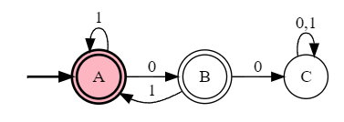
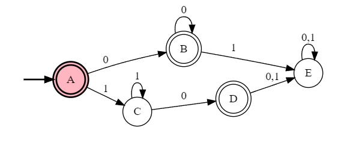

# 1
## a 
**True**
Let L is a finite language, and Let |L| = n, for some $n \geq 0$
For n = 0, $L = \phi$ and it is regular.
For $n>0$, 
lets , $L = \{a_1, a_2, a_3,....a_n\}$ where $a_k\ for \ k \geq 1$ is the individual string in $L$.
Now, for each string $a_k \in L$ we generate a new Language, $L_k = {a_k}$ for $k\geq 1$.
We can draw a DFA for a language that define a single string. therefore all $L_k$ for $k\geq 1$ is regular.
Since, $L = L_1 \cup L_2 \cup .....\cup L_k$ and set of regular language is closed under Union operation. therefore L is a regular language.

## b
F, proof this by showing an example.
:question: For proving false when we have Every in the statement, giving one example contradicting the statement should suffice to proof that the satement is false.
We will disprove this satement with an example,
Let, $L = \{W \in \{0, 1\}^*$| W contains an even number of 0's$\}$
This is a regular language as we have constructed this DFA in Lecture 7, but it is a infinite language.
## c
T
If L is regular then there is a Machine M that outputs yes for all string $x \in L$.
Now since L

For input alphabets a and b, a* b* is regular. A DFA can be drawn for a* b* but $a^nb^n $for n≥0 which is a subset of a*b* is not regular as we cannot define a DFA for it.

Language of all binary string is regular, we can draw a DFA. with one state.
But $L_m = \{W \in \{0,1\}*$|$W = 0^k1^k,$for $k\geq 0\}$ is not regular even thous it is a subset of all binary string.
## d
F
Q1:Prove that Regular Sets are NOT closed under infinite union. (A counterexample suffices).

Ans1: Consider the sets {0}, {01}, {0011}, etc. Each one is regular because it only contains one string. But the infinite union is the set {0i1i | i>=0} which we know is not regular. So the infinite union cannot be closed for regular languages.

Q2: What about infinite intersection?

Ans2: We know that

{0i1i | i>=0} = {0} U {01} U {0011} U ...,

Taking complements and applying DeMorgan's law gives us

{0i1i | i>=0}c = {0}c ^ {01}c ^ {0011}c ^ ...,

## e
Regular language are closed under union.
## f

```
#states
A
B
C
#initial
A
#accepting
A
B
#alphabet
0
1
#transitions
A:0>A,B
A:1>A
B:1>C
```
Try 2 strings ending with 01 and see the difference in this DFA
Give counter example.
## g
F, proof this by showing an example
$L$ = {00, 1, 10, 11}
A = 00
B = 1
X = 0
Accordign to definition, $\forall,$X if $AX \in L$ if and only if $BX \in L$,
but in our example, $AX \notin L$ but $BX \in L$
# 2
## a 
$\mathscr{L}(M) = \{W \in {0, 1}^* | W\ has\ no\ consecutive\ 0's\}$

<!-- 0+(1+$+01)(1+01)*(0+1+$+01)+1+$+01

0+(1+01)(1+01)*(0+1+01)+1+$+01


- State A:
  - No consecutive 0 is found 
  - string ends in 1
- State B:
  - No consecutive 0 is found
  - string ends with 0
- State C:
  - Have seen 2 or more consecutive 0's -->
## b
> We will reference this diagram for our proof. This DFA is constructed from the given DFA description.


#### Invariants
__To prove:__
After running the DFA on input $W$, the following three Invariants are true.
**Invariant 1:** If the current state is A, then $W$ has no consecutive 0's and if $|W|\geq 1$ then, the last symbol of $Y$ is 1
**Invariant 2:** If the current state is B, then $W$ has no consecutive 0's and last symbol of $W$ is 0.
**Invariant 2:** If the current state is C, then $W$ has at least one instance of consecutive 0's.
<!-- | No  | State | Invariant                                             |
| --- | :---: | ----------------------------------------------------- |
| 1   |   A   | String has no consecutive 0's.                        |
| 2   |   B   | String has no consecutive 0's. Last symbol read is 0. |
| 3   |   C   | Have seen at least one instance of consecutive 0's.   | -->


#### Proof:
We proceed by induction on the length of $W$.

#### Base case
For the base case, $W=\epsilon$, notice that we are in $A$and $W$ has no 2 consecutive 0's. hence out invariant 1 is true.

When $W=\epsilon$ we are not in state $B$ and $C$, so invariant 2 and 3 are vacuously true.

#### Induction hypothesis
Assume that, after running the DFA on any string Y of length $k\geq 0$, the following statements are true:
1. If the current state A, then Y has no consecutive 0's and if $|Y|\geq 1$ then, the last symbol of $Y$ is 1.
2. If the current state B, then Y has no consecutive 0's. Last symbol of $Y$ is 0.
3. If the current state C, then Y has at least one consecutive 2 0's.

#### Inductive step
<!-- After running the DFA on any string W of length $k+1$
We need to proof:
1. If the current state A, then W has no consecutive 0's. Last symbol of $W$ is 1.
2. If the current state B, then W has no consecutive 0's. Last symbol of $W$ is 0.
3. If the current state C, then W has at least one consecutive 2 0's. -->
Let's consider a string $W$ of length $k+1$, such that, $W = Y \cdot z,$ where $z$ is the final symbol of $W$.

##### Invariant 1
Suppose that after reading $W = Y \cdot z$, the current state is $A$,
From the diagram of machine, we conclude that the machine was in state $A$ or $B$ after reading $Y$,
For z = 1, we consider, 
**Case 1:** consider the machine was in State $A$,
By induction hypothesis, $Y$ has no consecutive 0's, hence $W = Y \cdot z$ also has no consecutive 0's.
**Case 1:** consider the machine was in State $B$,
By induction hypothesis, $Y$ has no consecutive 0's, hence $W = Y \cdot z$ also has no consecutive 0's.


##### Invariant 2
Suppose that after reading $W = Y \cdot z$, the current state is $B$,
From the diagram of machine, we conclude that the machine was in state $A$ after reading $Y$,
For z = 0,
By induction hypothesis, 
$Y$ has no consecutive 0's and the last symbol of Y is 1. therefore, $W = Y \cdot z$ has no consecutive 0's.


##### Invariant 3
Direct Proof: Suppose that after reading $W = Y \cdot z$, the current state is $C$,
There 2 cases of z for whcih we can be in state $c$
###### Case 1
z = 0
From the diagram of machine, we conclude that the machine was in state $B$ or $C$ after reading $Y$,

- **Case 1.1** (machine was in state $B$)
  - By induction hypothesis, $Y$ has no 2 consecutive 0 and the last symbol of the string is 0.
  - Since z = 0, $W = Y \cdot z$ has at least one consecutive 0's.
- **Case 1.2** (machine was in state $C$)
  - By induction hypothesis, $Y$ has at least one consecutive 2 0's.
  - therefore $W = Y \cdot z$ also has at least one consecutive 2 0's.

###### Case 2
z = 1
From the diagram of machine, we conclude that the machine was in state $C$ after reading $Y$,

By induction hypothesis $Y$ has at least one consecutive 0's.
therfore $W = Y \cdot z$ has at least one consecutive  0's.

Hence by induction principle all the invariants are proved.

- From the machine description we see that the accepting states are **$A,\ B$**
- We proved invariant 1: if the machine is in state **A**, then the string has no consecutive 2 0's.
- We proved invariant 2: if the machine is in state **B**, then the string has no consecutive 2 0's.
- We proved invariant 3: if the machine is in state **C**, then the string has at least 1 consecutive 2 0's.
- In other words M accepts $W \implies W$ has no consecutive 0's, and, M rejects $W \implies W$ has consecutive 0's. Thus proving our statement in part a.


<!-- ```
#states
A
B
C
#initial
A
#accepting
A
B
#alphabet
0
1
#transitions
A:0>B
A:1>A
B:0>C
B:1>A
C:0>C
C:1>C
``` -->
http://ivanzuzak.info/noam/webapps/fsm2regex/


## 3
### a
0(0+1)*1+1(0+1)*0

<!-- ```
#states
A
B
C
D
E
#initial
A
#accepting
C
E
#alphabet
0
1
#transitions
A:0>B
A:1>D
B:0>B
B:1>C
C:0>B
C:1>C
D:0>E
D:1>D
E:0>E
E:1>D
``` -->

0(0+1)*1+1(0+1)*0

### b

((00)*0)(11)*+(00)*((11)*1)

(00)*(0(11)*+(11)*1)

<!-- ```
#states
A
B
C
D
E
F
#initial
A
#accepting
E
F
#alphabet
0
1
#transitions
A:0>B
B:0>C
B:1>D
C:0>B
C:1>F
D:1>E
E:1>D
F:1>C   
```  -->

### c

(0+10)*11(1)*0(1+0)*


<!-- ```
#states
A
B
C
D
#initial
A
#accepting
A
B
C
#alphabet
0
1
#transitions
A:0>A
A:1>B
B:0>A
B:1>C
C:0>D
C:1>C
D:0>D
D:1>D
``` -->

## 4
<!-- #states
A
B
C
D
E
#initial
A
#accepting
A
B
D
#alphabet
0
1
#transitions
A:0>B
A:1>C
B:0>B
B:1>E
C:0>D
C:1>C
D:0>E
D:1>E
E:0>E
E:1>E -->
### a


<!-- __Equivalence class__:
1. $1 \cdot 1^*$
2. $\epsilon$
3. $0 \cdot 0^*$
4. $1 \cdot 1^*0$ -->

| Class | Regular Expression                             | Set builder notation                              |
| ----- | ---------------------------------------------- | ------------------------------------------------- |
| $C_1$ | $1 \cdot 1^*$                                  | $\{W \in \{0, 1\}^* \| W=1^k\ where\ k \geq 1\}$  |
| $C_2$ | $\epsilon$                                     | $\{W \in \{0, 1\}^* \| W=\epsilon\}$              |
| $C_3$ | $0 \cdot 0^*$                                  | $\{W \in \{0, 1\}^* \| W=0^k\ where\ k \geq 1\}$  |
| $C_4$ | $1 \cdot 1^*0$                                 | $\{W \in \{0, 1\}^* \| W=1^k0\ where\ k \geq 1\}$ |
| $C_5$ | $1 \cdot 1^* \cdot 0(0+1)+0 \cdot 0^* \cdot 1$ | $\{W \in \{0, 1\}^* \| W=1^k0\ where\ k \geq 1\}$ |

All the Myhill-Nerode equivalence classes induced by L are as follows, 

$C_1=\{W \in \{0, 1\}^* \| W=1^k\ where\ k \geq 1\}$  
$C_2 =\{W \in \{0, 1\}^* \| W=\epsilon\}$             
$C_3=\{W \in \{0, 1\}^* \| W=0^k\ where\ k \geq 1\}$  
$C_4=\{W \in \{0, 1\}^* \| W=1^k0\ where\ k \geq 1\}$ 
$C_5=\{W \in \{0, 1\}^* \| W=1^k0\ where\ k \geq 1\}$ 

Two prove these are the Myhill-Nerode equivalence classes of L,
We need to prove that,
1. All strings in $C_1$ are equivalent to each other with respect to L.
2. All strings in $C_2$ are equivalent to each other with respect to L.
3. All strings in $C_3$ are equivalent to each other with respect to L.
4. All strings in $C_4$ are equivalent to each other with respect to L.
5. All strings in $C_5$ are equivalent to each other with respect to L.
6. There exists, a string in $C_1$, that is not equivalent to $C_2$ with respect to L.
7. There exists, a string in $C_1$, that is not equivalent to $C_3$ with respect to L.
8. There exists, a string in $C_1$, that is not equivalent to $C_4$ with respect to L.
9. There exists, a string in $C_1$, that is not equivalent to $C_5$ with respect to L.
10. There exists, a string in $C_2$, that is not equivalent to $C_3$ with respect to L.
11. There exists, a string in $C_2$, that is not equivalent to $C_4$ with respect to L.
12. There exists, a string in $C_2$, that is not equivalent to $C_5$ with respect to L.
13. There exists, a string in $C_3$, that is not equivalent to $C_4$ with respect to L.
14. There exists, a string in $C_3$, that is not equivalent to $C_5$ with respect to L.
15. There exists, a string in $C_4$, that is not equivalent to $C_5$ with respect to L.

> If a string is of the form $0^n$ where $n \$ or of the form $1^m$ where $m \gew 0$ then the string is in L.

**Proof: All strings in $C_1$ are equivalent to each other with respect to L.**
Let A and B be 2 arbritary string in $C_1$,
Consider string X, where
**case 1** X is of the form $1^k0$ where $k \geq 0$
then both $AX$ and $BX$ are of the form $1^m0$ where $m\geq 1$
therefore, $AX$ and $BX$ $\in L$
**case 2** X is not of the form $1^k0$  where $k \geq 0$
then none of the $AX$ or $BX$ are of the form $1^m0$ where $m\geq 1$ or $0^n$ where $n \geq 0$
therefore, $AX$, $BX$ $\notin L$
This concludes the proof that an arbitrary A and B from $C_1$ are equivalent with respect to L.

**Proof: All strings in $C_2$ are equivalent to each other with respect to L.**
Since $C_2$ has only one element therefore the statement is vacuously true

**Proof: All strings in $C_3$ are equivalent to each other with respect to L.**
Let A and B be 2 arbritary string in $C_3$,
Consider string X, where
**case 1** $X \in \{W \in \{0, 1\}^*|W = 0^n\ for\ n \geq 0\}$
then both $AX$ and $BX$ are of the form $0^m$ where $m \geq 0$ and thus $AX, BX \in L$
**case 2** $X$ contains at aleast one 1 as symbol.
then none of the $AX$ or $BX$ are of the form $1^m0$ where $m\geq 1$ or $0^n$ where $n \geq 0$
therefore, both $AX$ and $BX$ are not in L, as for a string starting with 0 can only contain 0, but X has at least 1 and thus both $AX$ and $BX$ at least one or more 1 and L has no such string.

This concludes the proof that an arbitrary A and B from $C_3$ are equivalent with respect to L.

**Proof: All strings in $C_4$ are equivalent to each other with respect to L.**

Let A and B be 2 arbritary string in $C_4$,
Consider string X, where
case 1 X = $\epsilon$
then both $AX$ and $BX$ are of the form $1^m0$ where $m\geq 1$

case 2 $X$ a non empty string,
then none of the $AX$ or $BX$ are of the form $1^m0$ where $m\geq 1$ or $0^n$ where $n \geq 0$

therefore, both $AX$ and $BX$ $\notin L$

This concludes the proof that an arbitrary A and B from $C_4$ are equivalent with respect to L.


**Proof: All strings in $C_5$ are equivalent to each other with respect to L.**
Let A and B be 2 arbritary string in $C_5$,
Consider an arbritary string X,
then none of the $AX$ or $BX$ are of the form $1^m0$ where $m\geq 1$ or $0^n$ where $n \geq 0$

i.e. for all X $AX$ and $BX$ $\notin L$
This concludes the proof that an arbitrary A and B from $C_5$ are equivalent with respect to L.


**Proof: There exists, a string in $C_1$, that is not equivalent to $C_2$ with respect to L.**
We chose, A = 11 from $C_1$ and B = $\epsilon$ from $C_2$,
for X = $\epsilon$
$A \cdot X \notin L$
$B \cdot X \in L$
therfore, $C_1, C_2$ forms seperate equivalence class

**Proof: There exists, a string in $C_1$, that is not equivalent to $C_3$ with respect to L.**
We chose A = 11 from $C_1$ and B = 00 from $C_3$,
for X = 00
$A \cdot X \notin L$
$B \cdot X \in L$

therfore, $C_1, C_3$ forms seperate equivalence class

**Proof: There exists, a string in $C_1$, that is not equivalent to $C_4$ with respect to L.**
We chose A = 11 from $C_1$ and B = $110$ from $C_4$,
for X = 0
$A \cdot X \in L$
$B \cdot X \notin L$
therfore, $C_1, C_2$ forms seperate equivalence class

**Proof: There exists, a string in $C_1$, that is not equivalent to $C_5$ with respect to L.**
We chose A = 11 from $C_1$ and B = $101$ from $C_5$,
for X = $0$
$A \cdot X \in L$
$B \cdot X \notin L$

therfore, $C_1, C_5$ forms seperate equivalence class

**Proof: There exists, a string in $C_2$, that is not equivalent to $C_3$ with respect to L.**
We chose A = $\epsilon$ from $C_2$ and B=$0$ from $C_3$,
for X = $10$
$A \cdot X \in L$
$B \cdot X \in L$
therfore, $C_2, C_3$ forms seperate equivalence class

**Proof: There exists, a string in $C_2$, that is not equivalent to $C_4$ with respect to L.**
We chose A = $\epsilon$ from $C_2$ and B = $10$ from $C_4$,
for X = $0$
$A \cdot X \in L$
$B \cdot X \notin L$
therfore, $C_2, C_4$ forms seperate equivalence class

**Proof: There exists, a string in $C_2$, that is not equivalent to $C_5$ with respect to L.**
We chose A = $\epsilon$ from $C_2$ and B = $101$ from $C_4$,
for X = $0$
$A \cdot X \in L$
$B \cdot X \notin L$
therfore, $C_2, C_5$ forms seperate equivalence class

**Proof: There exists, a string in $C_3$, that is not equivalent to $C_4$ with respect to L.**
We chose A = 00 from $C_3$ and B = $10$ from $C_4$,
for X = $0$
$A \cdot X \in L$
$B \cdot X \notin L$
therfore, $C_3, C_4$ forms seperate equivalence class

**Proof: There exists, a string in $C_3$, that is not equivalent to $C_5$ with respect to L.**
We chose A = 11 from $C_3$ and B = $101$ from $C_5$,
for X = $0$
$A \cdot X \in L$
$B \cdot X \notin L$
therfore, $C_3, C_5$ forms seperate equivalence class

**Proof: There exists, a string in $C_4$, that is not equivalent to $C_5$ with respect to L.**
We chose 10 from $C_4$ and $101$ from $C_5$,
for X = $\epsilon$
$A \cdot X \in L$
$B \cdot X \notin L$
therfore, $C_4, C_5$ forms seperate equivalence class

Thus we have proved that, $C_1, C_2, C_3, C_4, C_5$ are the 5 Myhill-nerode equivalence classes induced by the given L.
### b
We are drawing the corresponding DFA with 5 states.

