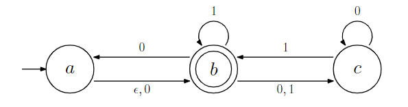
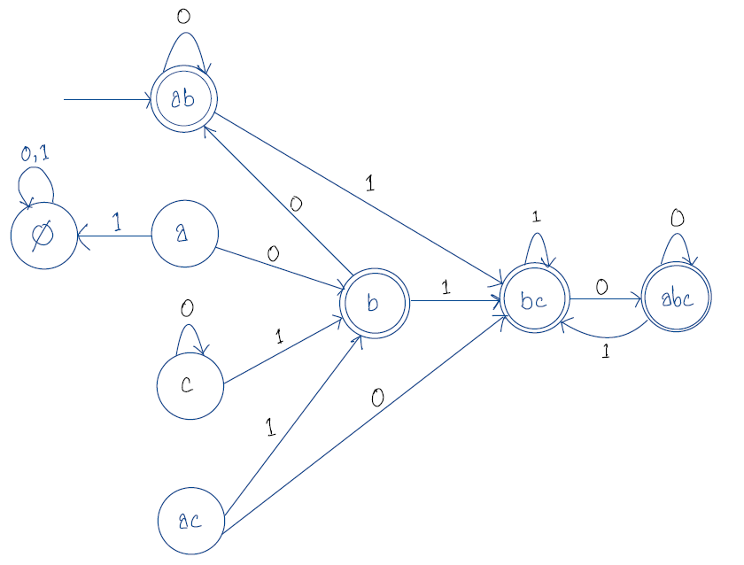
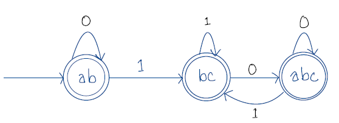

<!-- $1+0+\epsilon+(1+0+\epsilon)(1+0)^*(1+0+\epsilon)$
($+0)(1+0($+0)+(0+1)0*1)*
 -->
# a
**$Q = \{a, b, c, ab, ac, bc, abc\}$**
**$\sum = \{0, 1\}$**
<!-- | name  | States | 0          | 1         |
| ----- | ------ | ---------- | --------- |
| $q_0$ | $\Phi$ | $\Phi$     | $\Phi$    |
| $q_1$ | a      | b, $q_2$   | $\Phi$    |
| $q_2$ | b      | ab, $q_4$  | bc, $q_6$ |
| $q_3$ | c      | c, $q_3$   | b, $q_2$  |
| $q_4$ | ab     | ab, $q_4$  | bc, $q_6$ |
| $q_5$ | ac     | bc, $q_6$  | b, $q_2$  |
| $q_6$ | bc     | abc, $q_7$ | bc, $q_6$ |
| $q_7$ | abc    | abc, $q_7$ | bc, $q_6$ | -->
Transition table is given below,
**$\delta$ =**
 |        |   0    |   1    |
 | :----: | :----: | :----: |
 | $\Phi$ | $\Phi$ | $\Phi$ |
 |   a    |   b    | $\Phi$ |
 |   b    |   ab   |   bc   |
 |   c    |   c    |   b    |
 |   ab   |   ab   |   bc   |
 |   ac   |   bc   |   b    |
 |   bc   |  abc   |   bc   |
 |  abc   |  abc   |   bc   |

Since, $a$ and $b$ are all the states reacheable from start state of given NFA without reading any symbols.
Hence the starting state in the corresponding DFA, **$q_0 = ab$**

Since $b$ is the only accept state in the NFA, all the state in the DFA that contain $b$ is an accept state.
therefore, **$F = \{b, ab, bc, abc\}$**

We draw the equivalent DFA, 

After removing all the unreachable states the resultant DFA,

# b

$L = \{W \in {0, 1}^*\}$ = {set of all binary string}

