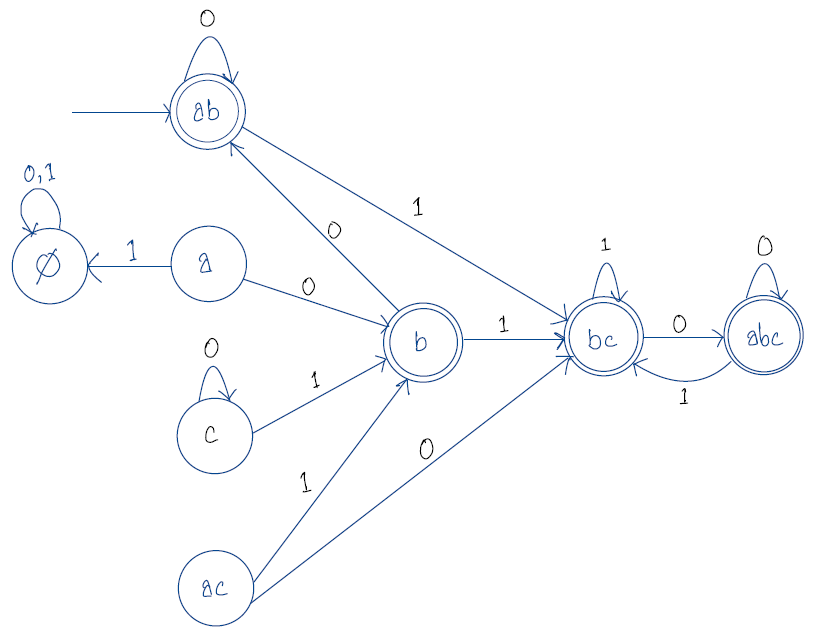
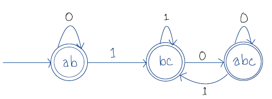

Let, $M = \{Q, \sum, \delta, q_0, F\}$
**$Q = \{a, b, c, ab, ac, bc, abc\}$**
**$\sum = \{0, 1\}$**

Transition table is given below,
**$\delta$ =**
 |        |   0    |   1    |
 | :----: | :----: | :----: |
 | $\Phi$ | $\Phi$ | $\Phi$ |
 |   a    |   b    | $\Phi$ |
 |   b    |   ab   |   bc   |
 |   c    |   c    |   b    |
 |   ab   |   ab   |   bc   |
 |   ac   |   bc   |   b    |
 |   bc   |  abc   |   bc   |
 |  abc   |  abc   |   bc   |

Since, $a$ and $b$ are all the states reacheable from start state of given NFA without reading any symbols.
Hence the starting state in the corresponding DFA, 
**$q_0 = ab$**

Since $b$ is the only accept state in the NFA, all the state in the DFA that contain $b$ is an accept state.
therefore, **$F = \{b, ab, bc, abc\}$**

We draw the equivalent DFA, 

After removing all the unreachable states the resultant DFA,

