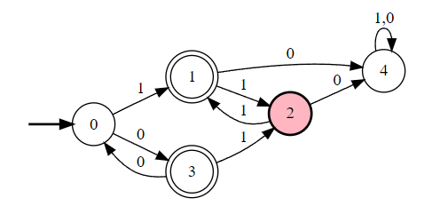

## a
$1(11)^*+0(00)^*(11+01)(11)^*+0(00)^*$
<!--  -->

## b
<!-- ```
#states
A
B
C
#initial
A
#accepting
A
#alphabet
0
1
#transitions
A:0>A
A:1>B
B:0>B
B:1>C
C:0>C
C:1>A
```
$0+\epsilon+10^*10^*1+(0+\epsilon+10^*10^*1)(0+10^*10^*1)^*(0+\epsilon+10^*10^*1)$
 -->

$(0+10^*10^*1)^*$


## c

$(0+(1+0(1+01))((0+10)(1+01))^*(0+10))0(0(((0+1(0+10))^*1+(0+1(0+10))^*)1+(0+1(0+10))^*(0+\epsilon+1(0+10)))+0)+(1+(0+1(0+10))((1+01)(0+10))^*(1+01))1(1(((1+0(1+01))^*0+(1+0(1+01))^*)0+(1+0(1+01))^*(1+\epsilon+0(1+01)))+1)$