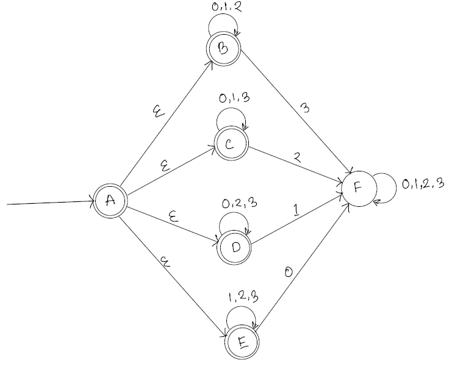

content
- [a](#a)
- [b](#b)
- [c](#c)
  - [Second attempt](#second-attempt)
# a

# b
<!-- **Q** = {State accepting empty string, only 1 accpetiong state}$\cup${State where at least one alphabet is missing, these are also accepting state} $\cup$ {State where all alphabets are present and it is the only reject state.} -->
<!-- **$\sum_n = \{0,..n\}$** -->

<!-- $F$= {State accepting empty string, only 1 accpetiong state}$\cup${State where at least one alphabet is missing, these are also accepting state}
or for $n\geq2$, let $q_i$ and $q_k$ any state with state invariant at least one alphabet is missing in the string leas upto this state.and $q_i$ and $q_k$ neither starting state., hence    -->

**Q** = $\{q\} \cup \{q_0, ...q_n\} \cup \{q_r\}$
**$\sum_n$** = $\{0,..n\}$

**Transition functions : $\delta$** 
-   $\delta(q, {\epsilon}) = \{q_0,...q_n\}$ 
-   $\delta(q_n, \sum_n - \{x_n\}) = \{q_n\}$ where $x_n$ is the $n^{th}$ symbol in $\sum_n$ 
-   $\delta(q_n, \{x_n\}) = \{q_r\}$ where $x_n$ is the $n^{th}$ symbol in $\sum_n$ 

**Start state** = $q$
**$F$** = $ Q - \{q_r\}$

# c
<!-- 
## First Attempt:
__Base case:__
for n = 2
$\sum_2 = \{0, 1\}$
$L_2 = \{W \in \sum^*$ | $W = 0^k$ for $k\geq 0\} \cup $ $\{W \in \sum^*$ | $W = 1^k$ for $k\geq 0\}$ 

For $A = 0$ and $B = 1$
for $x = 1$
$A\cdot x \notin L$ but $B\cdot x \in L$ but  
Therefore 0 and 1 are 2 separate equivalence class.

For $A = \epsilon$ and $B = 1$
for $x = 0$
$A\cdot x \in L$ but $B\cdot x \notin L$ but  
Therefore $\epsilon$ and 1 are 2 separate equivalence class.

For $A = \epsilon$ and $B = 0$
for $x = 1$
$A\cdot x \in L$ but $B\cdot x \notin L$ but  
Therefore $\epsilon$ and 0 are 2 separate equivalence class.

For $A = \epsilon$ and $B = 10$
for $x = 1$
$A\cdot x \in L$ but $B\cdot x \notin L$ but  
Therefore $\epsilon$ and 0 are 2 separate equivalence class.

For $A = 0$ and $B = 10$
for $x = 0$
$A\cdot x \in L$ but $B\cdot x \notin L$ but  
Therefore $\epsilon$ and 0 are 2 separate equivalence class.

For $A = 1$ and $B = 10$
for $x = 1$
$A\cdot x \in L$ but $B\cdot x \notin L$ but  
Therefore $\epsilon$ and 0 are 2 separate equivalence class.

Therefore we have showed that we have at least 4 or $2^n$ for $n = 2$ equivalence classes for $L_2$ hence the DFA that defines $L_2$ has at least $2^2$ states.

__Induction Hypothesis__
Assume for n = m, $\sum_M = \{0, 1, ...., m-1\}$,
the language $L_m$ has at least $2^m$ equivalence classes. and the DFA has $2^m$ states.

__Induction Step__
Now, for n = m+1, $\sum_M = \{0, 1, ...., m\}$, we will show that $L_{m+1}$ has $2^{m+1}$ equivalence classes and thus $2^{m+1}$ states in the smallest possible DFA that decides $L_{m+1}$

For an arbritary equivalence class pair of $L_m$ is$C_1$ and $C_2$
$\exists X$such that,  for $A \in C_1$ and $B \in C_2$ 
**case 1:**
$A\cdot X\in L$
and $B\cdot X\notin L$.

then, let's assume $X_{m+1}$ is the $m^{th}$ alphabet in $\sum_{m+1}$
therefore both $A \cdot X$ and $B \cdot X$ are in $L_{m+1}$ as they at least have $X_{m+1}$ missing.
But $B \cdot X$ has all the alphabet that are in $\sum_m$ therefore $B\cdot X \cdot X_{m+1}$ has all the alphabet that are in $\sum_{m+1}$ therefore $B\cdot X \cdot X_{m+1}$ or $B \cdot X_a$ where $X_a = X \cdot X_{m+1}$, is also not in L.

Now for $A \cdot X$ these exist a string $s \in \sum_m$ that is not a substring of $A \cdot X$ 
therefore for $A \cdot X_a$ these exist a string $s \in \sum_m$ that is not a substring of $A \cdot X_a$ 
therefore for $A \cdot X_a$ these exist a string $s \in \sum_{m+1}$ that is not a substring of $A \cdot X_a$ 
Hence $A \cdot X_a \in L_{m+1}$

therefore $C_1\ and\ C_2$ are also equivalence class of $L_{m+1}$

**case 2:**
$A\cdot X\notin L$
and $B\cdot X\in L$.

Same as above.

And further,
Now let's consider a equiavalence class generated from from one of the existing  -->

## Second attempt
Let's consider, $P(\sum_n)$ It gives all possible combination of alphabets in $\sum_n$

Now we know that, $|P(\sum_n)| = 2^m$

<!-- For all set $S_1, S_2 \in P(\sum_n)$, let's consider a set of string that  -->
Let's consider a string A and B such that, for an arbritary $S_A, S_B \in P(\sum_n)$ $A$ has all alphabets in $S_A$ at least once and  $B$ has all alphabets in $S_B$ at least once.

__case 1: $|S_A| \leq |S_B|$__
then, $|\sum_n - S_A| \geq |\sum_n - S_B|$
let's consider a string $X$ that has all alphabets from $\sum_n - S_B$, then
$A \cdot X \in L_n$ since $\exist x \in \sum_n,$ and $A \cdot X$ does not contain $x$
but since $\sum_n - S_B$ is complement of $S_B$ considering $\sum_n$ as the unversal set.
hence $B \cdot X$ has all the alphabets from $\sum_n$ 
therefore, $B \cdot X \notin L_n$ 
Therefore string A and B are in 2 different equivalence class.

__case 2: $|S_A| > |S_B|$__
then, $|\sum_n - S_A| < |\sum_n - S_B|$
let's consider a string $X$ that has all alphabets from $\sum_n - S_A$, then
since, $\forall x \in \sum_n,$ and $A \cdot X$ contain $x$ at least once, $A \cdot X \notin L_n$ 
But, $\exist x \in \sum_n,$ and $B \cdot X$ does not contain $x$, therefore $B \cdot X \in L_n$
Therefore string A and B are in 2 different equivalence class.

We have $|P(\sum_n)|$ or $2^n$ such equivalence classes. Therefore the DFA that decides $L_n$ has atleast $2^n$ states.