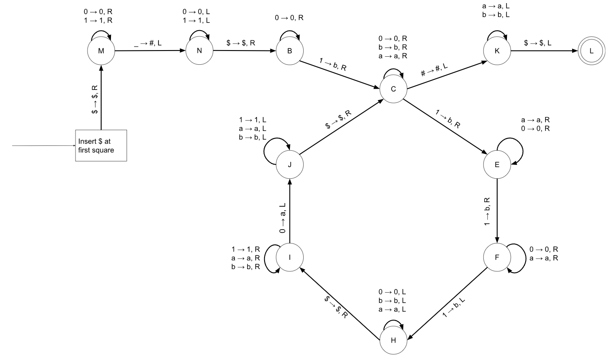

# a

We assume the string is weitten on tape and starting from the leftmost square.

## Pseudocode:
1. Use lecture 37 TM to inset $\$$ at the leftmost square, and shift all strings to the left.
2. Move right until the first non **0** or non **1** symbol.
3. If the current square symbol is **$\_$** or empty symbol replace the empty symbol with **#** else **reject**. [transitioning to state ___N___ from state ***M***]
4. Move left until the first non **1** or  non **0** symbol. [state ___N___]
5. If the current square symbol is **$**, then move right. Else **reject**. [transitioning  to state ___B___]
6. Move right until the current square is non **0**. [state ___B___]
7. If the current square symbol is **1** then replace **1** with **b** else **reject**. [transitioning to state ___C___]
8. Move right until the current square is non **0** or non **a** or non **b** [state ___C___] 
9. If the current square Symbol is **1** replace **1** with **b** and move right,
   Else If current square Symbol is **#** move to step **20**.
   Else **reject**.
10. Move right until the first non **a** or non **0** symbol. [state ___E___]
11. If the current square symbol is **1** then replace **1** with **b** else **reject**. This corresponds to state transition from **E** to **F** 
12. Move right until the first non **a** or non **0** symbol.[state ___F___]
13. If the current square symbol is **1** then replace **1** with **b** else **reject**. This corresponds to state transition from **F** to **H**.
14. Move left until the first non **a** or non **b** or non **0** symbol.[state ___H___]
15. If the current symbol is **$** then move right, else **reject**. This corresponds to transition from state ***H*** to ***I***
16. Move right until the first non **a** or non **b** or non **1** symbol.[state ___I___]
17. If the current symbol is **0** then replace **0** with **a** else **reject**. This corresponds to state transition from state ***I*** to ***J***.
18. Move left until the first non **a** or non **b** or non **1** symbol.[state ___J___]
19. If the current symbol is **$** then move to step **8** else **reject**. this corresponds to transtion from state ***J*** to state ***C***.  
20. Move left. this corresponds to transtion from state ***C*** to state ***K***.
21. Move left until the first non **a** or non **b** symbol.[state ___K___]
22. If the current symbol is **$** then move left and ***Accept*** else **reject**. This corresponds to transtion from state ***K*** to final accepting state ***L***.

<!-- 
9. **#** or **1**. [state ___C___]
   8.1. If the current Square is **#** Move left. Follow steps [7.1.1 - 7.1.$]
      - Step 8.1.1.: Move left if the current square symbol is **a** or **b** 
      - Step 8.1.2.: current square is **$**
      - Step 8.1.3.: Move left, If the current square is **$** Accept.
      
   8.2 If the current Square is **1** Replace **1** with **b** and move right. Follow steps [7.2.1 - 7.2.$]
   
---
Explaination:
1. First we used the machine from lecture 37 to inser the $\$$ at the left most square, after shifting all symbols to right. After using that machine our tape head was pointing at the leftmost square, So we read $\$$ and move the tapehead one step left, And we transition to state **M**. 
2. Where we keep moving the tapehead to right on seeing symbol 1 and 0 without replacing the symbol. Once we saw an empty tape symbol, **_**, we replaced it with **#** marking the end of our given string 1 step left of this symbol. While moving the tapehead one step left at the sametime we move to state **N**.
3. At state **N** we keep moving the tapehead left each time we see 0 or 1 until we see $\$$ without replacing any symbol, on seeing $\$$ symbol we move tapehead to right and move to state **B**. 
4. From state **B** we keep moving the tapehead one step right each time we see a 0 without replacing the symbol,  On seeing a 1 we replace it with b and move the tapehead to right and move to state **C**.
5. From **C** we keep moving the tapehead right each time we see 0, a or b without replacing any symbol. 
   1. On seeing a 1 at state **C**:
      1. we replace it with b and move the tapehead to right also move to state **E**.
      2. From state **E** we keep moving the tapehead right each time we see 0 or a without replacing any symbol. On seeing a 1 we replace it with b and move the tapehead to right also move to state **F**.
      3. From state **F** we keep moving the tapehead right each time we see 0 or a without replacing any symbol. On seeing a 1 we replace it with b and move the tapehead to left also move to state **H**.
      4. At state **H** we keep moving the tapehead left each time we see 0, a or b until we see $\$$ without replacing any symbol, on seeing $\$$ symbol we move tapehead to right and move to state **I**.
      5.  At state **I** we keep moving the tapehead right each time we see 1, a or b until we see 0 without replacing any symbol, on seeing 0 we replace it with symbol a and we move tapehead to left and move to state **J**.
      6.  At state **J** we keep moving the tapehead left each time we see 1, a or b until we see $\$$ without replacing any symbol, on seeing $\$$ symbol we move tapehead to right and move to state **C**.
  2. On seeing a # at state **C**:
     1. We move the tapehead 1 step left with replacing the symbol. and move to state **K**.
     2. Once at **K** we keep moving the tapehead left each time we see a or b until we see $\$$ without replacing any symbol, on seeing $\$$ symbol we move tapehead to left and move to final state **L**.

Simplified:
1. We first prep the tape my putting a $ at the left most square and # of the string.
2. Once, that is done, we mark the first 1 with b and move to state C. From there We go through C &rarr; E &rarr; F &rarr; H &rarr;I &rarr; J and C again. In this cycle we mark 1 0 by a for each 3 1's marked b. 
3. After marking all symbols if we see a # at C we move to K and then check of we have any unmaked symbol in the string, if not we move to L and thus reaching the final state.
         -->