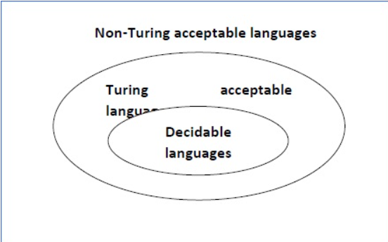

<!--  --> 

# a
False
We devised a Turing Machine called **U** that recognizes $Accept_{TM}$ and we proved that it does not decide $Accept_{TM}$ [From lecture 51]. 
A Turing Machine can recognize only one language hence, there is language $L'\not ={Accept_{TM}}$ such that U recognizes $L'$.
It follows that, U only recognize $Accept_{TM}$, it doesn't recognize any other language.
i.e. $\forall L' | L' \not ={Accept_{TM}},\exist W \in L' | U$ doesn't accepts $W$ or $\exist W \notin L' | U$ accepts $W$.
It follows that, $U$ also doesn't decide any $L' \not ={Accept_{TM}}$.
Now in **lecture**, we proved $U$ does not decide $Accept_{TM}$

Therefore, $\exist$ a TM $U$, such that, $\forall L$ $U$ doesn't decide $L$.
