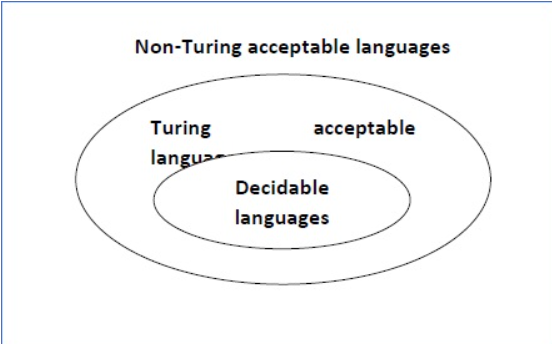

<!--  -->
# b

True
For an arbritary Turing machine $T_m$, $\mathscr{L}(T_m) = \{W \in \{0, 1\}^* | W$ is accepted by $T_m\}$
We are only considering language consisting binary string as language made up of other alphabets can be encoded in binary.
Now if, $W \notin \mathscr{L}(T_m)$ then $T_m$ doesn't accept $W$, 
Hence, $T_m$ recognizes $\mathscr{L}(T_m)$
It follows that, $\forall T_m, \exist \mathscr{L}(T_m) or L$ such that, $T_m$ recognizes $L$.