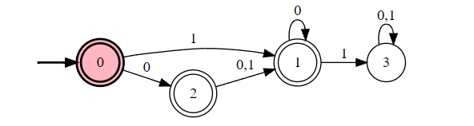

# DFA practice
## 1
regex = (0*001)+(0*0100*)+(1000*)

## 2
regex = 0(1+0)0*+(1+0)0*+0*

## 3 a
$+0+01+011+011(0*1*)*+1+10+101+101(0*1*)*+11+11(0*1*)*
simplified: $+0+0(1+11(0+1)*)+1+1(0+(01+1)(0+1)*)

## 3 b

(0*1*)*001(0*1*)*
