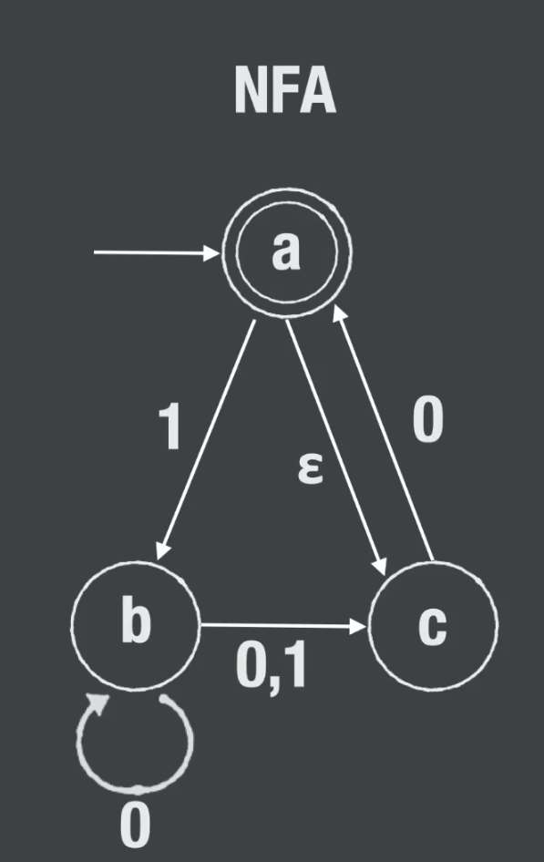

Content
- [Lecture 17](#lecture-17)
  - [Convert NFA to DFA Using Subset construction](#convert-nfa-to-dfa-using-subset-construction)
- [Lecture 16 (Operation on Languages)](#lecture-16-operation-on-languages)
    - [Proof If L is regular, then suffix(L) is regular.](#proof-if-l-is-regular-then-suffixl-is-regular)
## Lecture 17
### Convert NFA to DFA Using Subset construction

The NFA:

__Converstion Table__
|        | 0      | 1      |
| ------ | ------ | ------ |
| $\phi$ | $\phi$ | $\phi$ |
| a      | $\phi$ | b      |
| b      | bc     | c      |
| c      | ac     | $\phi$ |
| ab     | bc     | bc     |
| ac     | ac     | b      |
| bc     | abc    | c      |
| abc    | abc    | bc     |

> After filling in single state rows, the rest is union of corresponding state.

After building DFA check if there is any state that has no incoming arrow, therefore we can not reach those state.
If NFA has size $k$ then DFA has $2^k$ whre is $K$ is the number of states

## Lecture 16 (Operation on Languages)
$f(L)$ = A new language after doing some operation on items in

Example suffix(L)
$\{S \in \sum^* | \exists W \in L, \exist Y \in \sum^* \ such \ that \ W = Y \cdot S\}$

#### Proof If L is regular, then suffix(L) is regular.
**Approach:** Assume L is regular, then there is a M that decides L, 
modifying M we will build an NFA that decides suffix(L)